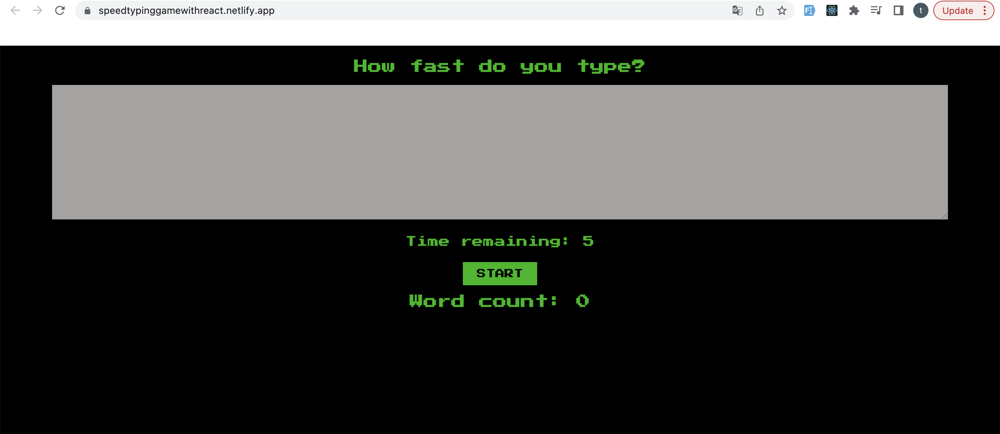

# Advanced React Project

## Speed Typing Game

The aim of the game is to automatically receives focus and let the user start typing right away. then the time runs out, the textarea is disabled again and it gives us the number of words we are able to type them in given time.

This project helped me to practice useEffect hook, useState hook, useRef hook and custom hook. 
## Deployment

[https://speedtypinggamewithreact.netlify.app/](https://speedtypinggamewithreact.netlify.app/)


## Overview


## Tools and Technologies

- Advanced React
  - Custom Hooks
  - useContext
  - State, useState
  - UseEffect, useRef
  - Form, Input, Button
  - setTimeout
  - onChange & onClick
  - Declarative methods

### Devops

- Netlify

## Setup

To run the app, type `npm start` in the CLI.

## Sample React code

Here is a look at how to set up an effect that runs every time the `timeRemaining` or `isTimeRunning` change. The effect will wait 1 second, then decrement the `timeRemaining` by 1. When the time is zero, game will be ended.

```
 useEffect(() => {
        if(isTimeRunning && timeRemaining > 0) {
            setTimeout(() => {
                setTimeRemaining(time => time - 1)
            }, 1000)
        } else if(timeRemaining === 0) {
            endGame()
        }
    }, [timeRemaining, isTimeRunning])

```